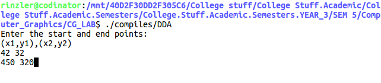
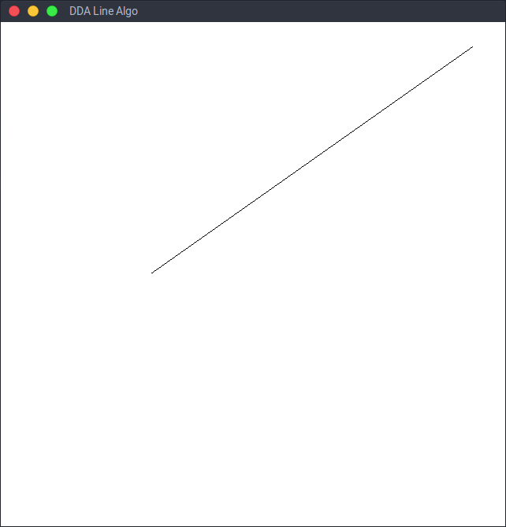

# <center><u>Program 1</u></center>
### AIM: To write a C program to implement the DDA line drawing algorithm.

### Description of Aim & Related Theory:
- #### Line Drawing Algorithm:  
	- A straight-line segment in a scene is defined by the coordinate positions for the
    endpoints of the segment.  
    - To display the line on a raster monitor, the graphics system
    must first project the endpoints to integer screen coordinates and determine
    the nearest pixel positions along the line path between the two endpoints.   
    - Then the line color is loaded into the frame buffer at the corresponding pixel coordinates.  
    - Reading from the frame buffer, the video controller plots the screen pixels. This
    process digitizes the line into a set of discrete integer positions that, in general,
    only approximates the actual line path
- #### The Digital Differential Analyzer (<i>DDA</i>) Algorithm:  
    - The digital differential analyzer (DDA) is a scan-conversion line algorithm based on
      calculating either δy or δx using either of the following:  
     	
        <center>δx = δy/m</center>  
    - A line is sampled at unit intervals in one coordinate and the corresponding integer values nearest the line path are determined for the other coordinate. Considering lines with positive slopes, if slope is <= 1 then we increment δx and calculate y as :  
		<center>yk+1 = yk + m</center> 
        For lines with a positive slope greater than 1.0, we reverse the roles of x and y:  
        <center>xk+1 = xk +1/m</center>  
    - This algorithm is summarized in the following procedure, which accepts as input two integer screen positions for the endpoints of a line segment. Horizontal and vertical differences between the endpoint positions are assigned to parameters dx and dy. The difference with the greater magnitude determines the value of parameter steps. This value is the number of pixels that must be drawn beyond the starting pixel; from it, we calculate the x and y increments needed to generate the next pixel position at each step along the line path. We draw the starting pixel at position (x0, y0), and then draw the remaining pixels iteratively, adjusting x and y at each step to obtain the next pixel’s position before drawing it. If the magnitude of dx is greater than the magnitude of dy and x0 is less than xEnd, the values for the increments in the x and y directions are 1 and m, respectively. If the greater change is in the x direction, but x0 is greater than xEnd, then the decrements −1
and −m are used to generate each new point on the line. Otherwise, we use a unit increment (or decrement) in the ydirection and an x increment (or decrement) of 1/m .    
---

### Algorithm:
``` psuedo
1. read the end points (x1,y1) and (x2,y2)
2. calculate δx = |X2-X1| and δy = |Y2-Y1|
3. if(δx > δy):
4. 	steps = δx
5. else:
6.	steps = δy
7. select the raster unit:
8.	dx = (X2-X1)/steps
9.	dy = (Y2-Y1)/steps
10. x = X1 + 0.5*sign(dx) 
11. y = Y1 + 0.5*sign(dy)
12. // The sign function returns 1 for dx > =, -1 for < 0 and = for dx = 0
13. plot the points:
14.	for(i = 0 to steps):
15.		plot(round(x),round(y))
16.		x = x + dx
17.		y = y + dy
18. //The round functions rounds x to nearest integer.
```
---
### Code:    
``` cpp
#include <GL/glx.h>    
#include <GL/gl.h>
#include <GL/glut.h>
#include <stdio.h>
#define round(a) ((int)(a+0.5))
struct line
{
	int x1, y1;
	int x2, y2;
}L;
typedef struct line line;
void init(line *l)
{
	l->x1 = l->x2 = l->y1 = l->y2 = 0;
}
void getLine(line *l)
{
	printf("Enter the start and end points:\n(x1,y1),(x2,y2)\n");
	scanf("%d %d", &l->x1, &l->y1);
	scanf("%d %d", &l->x2, &l->y2);
}
int sign(int x)
{
	if (x==0)
		return 0;
	else
		return x<0? -1:1;
}
void setpX(GLint XCv, GLint yCv)
{
	glBegin (GL_POINTS);
		glVertex2i(XCv,yCv);
	glEnd();
}
int absl (int n)
{
    return ( (n>0) ? n : ( n * (-1)));
}
void DDA()
{
	float dx = L.x2-L.x1;
	float dy = L.y2-L.y1;
	float len = absl(dx) > absl(dy) ? absl(dx) : absl(dy) ; 
	float delx = dx/(float)len;
	float dely = dy/(float)len;
	float x = L.x1, y = L.y1;
	setpX(x,y);
	while(len--)
	{
		setpX(round(x),round(y));
		x = x+delx;
		y = y+dely;
	}
	
	glFlush();
	glutSwapBuffers();
}
int main(int argc, char** argv)
{
	init(&L);
	getLine(&L);
	glutInit(&argc, argv);
	glutInitDisplayMode(GLUT_DOUBLE | GLUT_RGBA);
	glutInitWindowSize(640,640);
	glutCreateWindow("DDA Line Algo");
	glutDisplayFunc(DDA);
	gluOrtho2D(640,0,640,0);
	glutMainLoop();
	return 0;
}
```
---
### Results and outputs:  
the command line inputs.  

   
The generated line.   
  

---
### Findings and Learnings:
1. The DDA Algo is much faster than the direct line equation as there's no floating point calculations involved.
2. It's the simplest algorithm and does not require and special skills for implementation.
3. It's orientation dependent, due to which end point accuracy is poor.
4. Floating point additions are still very expensive operations. 
5. The cumulative errors due to limited floating point precision may cause the calculated points to drift away from the actual line.  

---
