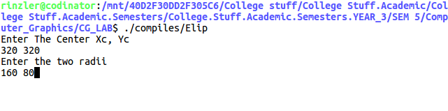
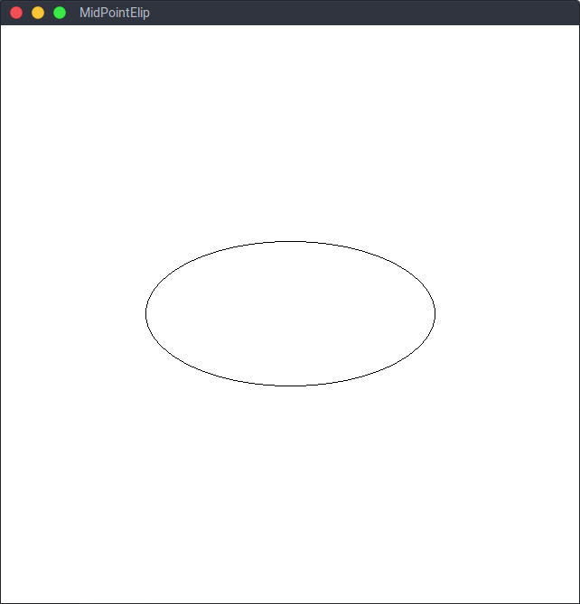

# <center><u>Program 4</u></center>
### AIM: To write a program to implement the Mid-Point Ellipse Algorithm in C..

### Description of Aim & Related Theory:
- #### Ellipses in Computer Graphics: 
    - Just like lines, ellipses are another primitive shape used in computer graphics.

    - An ellipse is defined as the set of points such that the sum of the distances from two fixed positions (foci) is the same for all points. If the distances to the two foci from any point on the ellipse are labeled d 1 and d 2 , then the general equation of an ellipse can be stated as :    

      <center>

      ​	

      </center>

    - Expressing distances d 1 and d 2 in terms of the focal coordinates and , we have:  

      <center>

      ​	

      </center>

    - Ellipse equations are greatly simplified if the major and minor axes are oriented to align with the coordinate axes. An ellipse in &quot;standard position&quot; has major and minor axes oriented parallel to the x and y axes respectively.  

    - Parameter rx labels the semi-major axis, and parameter ry labels the semi-minor axis. The equation of the ellipse can be written in terms of the ellipse center coordinates and parameters rx and ry as :   

      <center>

      ​	

      </center>

    - Alternatively, one could use the polar coordinates, but yet again they come at a higher computational cost, thus more efficient algorithms have been designed to draw ellipses.

      ​

- #### The Mid Point Circle Drawing Algorithm: 
    - The approach here is similar to that used in displaying d raster circle. Given parameters rx, ry and (xc, yc), we determine points (x, y) for an ellipse in standard position centered on the origin, which are then shifted so that the ellipse is centered at (x, y,).

    - The algorithm is applied in the first quadrant in two parts. In the first octant, we take unit steps in x while we calculate the y values, here the slope of the line is < 1. In the second octant, we take unit steps in y while we calculate the x values, here the slope of the line is > 1.

    - The start point is taken as (0, Ry) and the stepping is clockwise. To apply the algorithm we use the following as the elipse function of an ellipse centered at (0, 0).  

    - <center>

      ​	

      </center>  

      where

      <center>

      ​	

      </center>  

    - Here, the slope is given be :  

      <center>

      ​	

      </center>    

      At the boundary between the two octants, the slope is -1. and  we move out of octant 1 when  

      <center>

      ​	

      </center>  

    - In octant 1 the initial decision parameter P0 is obtained by evaluating the ellipse function at (0, Ry), given by:  

      <center>

      ​	

      </center>   

      And the parameter for the Kth point in octant 1 is given by:  

      <center>

      ​	

      </center> 

    - In the second octant, the initial position is the last position from the first octant. The decision parameter for this octant is given by:  

      <center>

      ​	

      </center>   

      And the parameter for the Kth point in octant 2 is given by: 

      <center>

      ​	

      </center> 

    - Assuming rx, ry and the ellipse center are given in integer screen coordinates, we only need incremental integer calculations to determine values for the decision parameters in the midpoint ellipse algorithm. The increments rx^2, ry^2, 2rx^2, and 2ry^2 are evaluated once at the beginning of the procedure.
---

### Algorithm:
``` python
1.  Input radii rx and ry and ellipse center (xc, yc)
2.  Set the coordinates for first point as:
3. 		(X0,Y0) = (0,r)
4.  Calculate the initial value of the decision parameter as:
5. 		P10 = ry^2 + rx^2/4 - rx^2ry
6.  At each xk position in octant 1, starting at k = 0, perform the following test:
7.  if(P1k < 0):
8. 		next_point = (Xk+1,Yk)
9. 		P1(k+1) = P1k + 2ry^2x(k+1) + ry^2
10. else:
11.		next_point = (Xk+1, Yk-1)
12.		P1(k+1) = P1k + 2ry^2x(k+1) + ry^2 - 2rx^2y(k+1)
14. Determine symmetry points in the other three octants.
15. Move each calculated pixel position (x, y) onto the circular path centered at (xc , yc ) and plot the coordinate values as follows:
16.		x = x + Xc
17.		y = y + Yc
18. repeat Lines 7-17 until 2ry^2x >= 2rx^2y.
19. Calculate the initial value of the decision parameter as:
20. 	p20 = ry^2(x0 + 1/2)^2 + rx^2(y0 - 1)^2 - rx^2ry^2
21. At each xk position in octant 2, starting at k = 0, perform the following test:
22. if(P2k > 0):
23. 	next_point = (Xk,Yk-1)
24. 	P2(k+1) = P2k - 2rx^2y(k+1) + rx^2
25. else:
26. 	next_point = (Xk+1,Yk-1)
27. 	P2(k+1) = P2k - 2rx^2y(k+1) + rx^2 - 2rx^2y(k+1)
28. Determine symmetry points in the other three octants.
29. Move each calculated pixel position (x, y) onto the circular path centered at (xc , yc ) and plot the coordinate values as follows:
30. 	x = x + Xc
31. 	y = y + Yc
32. Repeat lines 22 - 31 till y > 0
```
---
### Code:    
``` cpp
#include <GL/glut.h>
#include <stdio.h>

inline int round(float a) {return int(a+0.5);}

int Xc, Yc, Rx, Ry;

void setdata()
{
	printf("Enter The Center Xc, Yc\n");
	scanf("%d %d",&Xc,&Yc);
	printf("Enter the two radii\n");
	scanf("%d %d",&Rx,&Ry);
}

void setpX(GLint XCv, GLint yCv)
{
	glBegin (GL_POINTS);
		glVertex2i(XCv,yCv);
	glEnd();
}


void ElipPlotPts(GLint X, GLint Y, GLint x, GLint y)
{
	setpX(X+x, Y+y);
	setpX(X-x, Y+y);
	setpX(X+x, Y-y);
	setpX(X-x, Y-y);
}

void ElipMidPointHc()
{
    int Rx2 = Rx * Rx;
    int Ry2 = Ry * Ry;
    int Trx = 2*Rx2;
    int Try = 2*Ry2;
    int p;
    int x = 0;
    int y = Ry;
    int px = 0;
    int py = Trx * y;
    ElipPlotPts(Xc,Yc,x,y);
    //Region 1
    p = round(Ry2 + 0.25*Rx2 - (Ry*Rx2));
    while(px < py)
    {
    	x++;
    	px += Try;
    	if(p<0)
    	{
    		p += Ry2 + px;
    	}
    	else
    	{
    		y--;
    		py -= Trx;
    		p += Try + px - py;
    	}
    	printf("X = %d, Y = %d\n",x,y );
    	ElipPlotPts(Xc,Yc,x,y);
    }
    //Region 2;

    p = round(Ry2 * (x+0.5)*(x+0.5)+Rx2 * (y-1)*(y-1) - Rx2*Ry2);
    while(y > 0)
    {
    	y--;
    	py -= Trx;
    	if (p > 0)
    	{
    		p += Rx2 - py;
    	}
    	else
    	{
    		x++;
    		px += Try;
    		p += Rx2 - py + px;
    	}
    	printf("X = %d, Y = %d\n",x,y );
    	ElipPlotPts(Xc,Yc,x,y);
    }

	glFlush();
	glutSwapBuffers();
}

int main(int argc, char** argv)
{
	setdata();
	glutInit(&argc, argv);
	glutInitDisplayMode(GLUT_DOUBLE | GLUT_RGBA);
	glutInitWindowSize(640,640);
	glutCreateWindow("MidPointElip");
	glClearColor(255,255,255,0.f);
	glColor3f(0,0,0);
	glClear(GL_COLOR_BUFFER_BIT);
	glutDisplayFunc(ElipMidPointHc);
	gluOrtho2D(640,0,640,0);
	glutMainLoop();
	return 0;
}
```
---
### Results and outputs:  
the command line inputs.  

   
The generated line.   
  

---
### Findings and Learnings:
1. The midpoint method is used for deriving efficient scan-conversion algorithms to draw geometric curves on raster displays.  
2. The method is general and is used to transform the nonparametric equation f(x,y) = 0, which describes the curve, into an algorithms that draws the curve.
3. time consumption is high.
4. the distance between the pixels is not equal so we wont get smooth circle. 

---
