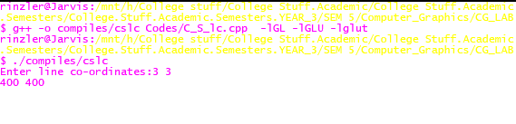

# <center><u>Program 5</u></center>
### AIM: To write a C program to implement flood fill polygon filling algorithm.

### Description of Aim & Related Theory:

+ #### Introduction:

  + Sometimes we come across an object where we want to fill the area and its boundary with different colors. We can paint such objects with a specified interior color instead of searching for particular boundary color as in boundary filling algorithm.  
  + Instead of relying on the boundary of the object, it relies on the fill color. In other words, it replaces the interior color of the object with the fill color. When no more pixels of the original interior color exist, the algorithm is completed. 


- #### The Flood Fill Algorithm:  
    + In Flood Fill algorithm we start with some seed and examine the neighboring pixels, however pixels are checked for a specified interior color instead of boundary color and is replaced by a new color. It can be done using 4 connected or 8 connected region method.

---

### Algorithm:
1. FloodFill(X, Y, old_color, new_color):
2. ​    if (get_pixel(X,Y) == old_color):
3. ​        put_pixel(X,Y,new_color)
4. ​        FloodFill(X-1, Y, old_color, new_color)
5. ​        FloodFill(X+1, Y, old_color, new_color)
6. ​        FloodFill(X, Y-1, old_color, new_color)
7. ​        FloodFill(X, Y+1, old_color, new_color)
8. ​    return

---
### Code:    
``` cpp
#include <GL/glx.h>    
#include <GL/gl.h>
#include <GL/glut.h>
#include <math.h>
#include <unistd.h>
#include <stdio.h>
#include <iostream>
using namespace std;


struct Rect {
	GLint x1,x2;
	GLint y1,y2;
	
};
Rect P;

//Structure to store the color details
struct Color {
	GLfloat r;
	GLfloat g;
	GLfloat b;
};


void get_Rect()
{
	printf("Enter x1,y1\n");
	scanf("%d %d",&P.x1,&P.y1);
	printf("Enter x2,y2\n");
	scanf("%d %d",&P.x2,&P.y2);
}

//Initializes the OpenGL window to white BG origin bottom left.
void init() 
{
	glClearColor(1.0, 1.0, 1.0, 0.0);
	glColor3f(0.0, 0.0, 0.0);
	glPointSize(1.0);
	glMatrixMode(GL_PROJECTION);
	glLoadIdentity();
	gluOrtho2D(0, 640, 0, 640);
}

//Function to read pixel from screen and return its RGB values
Color getPixelColor(GLint x, GLint y) 
{
	Color color;
	glReadPixels(x, y, 1, 1, GL_RGB, GL_FLOAT, &color);
	return color;
}

//Function to set the pixel to new color
void setPixelColor(GLint x, GLint y, Color color) 
{
	glColor3f(color.r, color.g, color.b);
	glBegin(GL_POINTS);
		glVertex2i(x, y);
	glEnd();
	glFlush();
}

//The Flood Fill algorithm
void floodFill(GLint x, GLint y, Color oldColor, Color newColor) 
{
	Color color;
	color = getPixelColor(x, y);

	if(color.r == oldColor.r && color.g == oldColor.g && color.b == oldColor.b)
	{
		setPixelColor(x, y, newColor);
		floodFill(x+1, y, oldColor, newColor);
		floodFill(x, y+1, oldColor, newColor);
		floodFill(x-1, y, oldColor, newColor);
		floodFill(x, y-1, oldColor, newColor);
	}
	return;
}

void draw_rect() 
{
	glVertex2i(P.x1,P.y1);
	glVertex2i(P.x2,P.y1);	
	glVertex2i(P.x2,P.y2);
	glVertex2i(P.x1,P.y2);
}

//Calls the flood fill on mouse click
void onMouseClick(int button, int state, int x, int y)
{
	Color newColor = {0.45f, 0.77f, 0.5f};
	Color oldColor = {1.0f, 1.0f, 1.0f};

	floodFill((P.x1+P.x2)/2, (P.y1+P.y2)/2, oldColor, newColor);
}

//The main display function
void display() {

	//Draw the circle
	glClear(GL_COLOR_BUFFER_BIT);
	glBegin(GL_LINE_LOOP);
		draw_rect();
	glEnd();
	glFlush();
	glutSwapBuffers();
}


int main(int argc, char** argv)
{
	// get_Circle();
	get_Rect();
	glutInit(&argc, argv);
	glutInitDisplayMode(GLUT_SINGLE|GLUT_RGB);
	glutInitWindowSize(640, 640);
	glutCreateWindow("FloodFill");
	init();
	glutDisplayFunc(display);	
	glutMouseFunc(onMouseClick);
	glutMainLoop();
	return 0;
}
```
---
### Results and outputs:  
the command line inputs.  

   
The generated line.   
before coloring :  
  
after coloring:  
  

---
### Findings and Learnings:
1. Flood fill algorithm is for filling polygons. It's a basic recursion algorithm and requires a large stack for bigger polygons. For this reason it is generally not implemented as is. 
2. Implemented flood fill algorithm using OpenGL in C++. 

---
