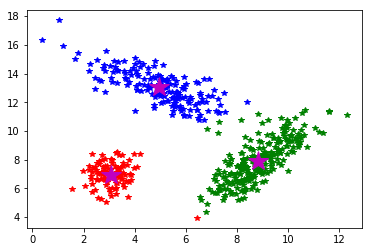

# <center>PRACTICAL 4</center> #
## Aim ##
To implement K-Means Clustering

## Description of aim and related theory ##
K-means is one of the simplest unsupervised learning algorithms that solve the well known clustering problem. The procedure follows a simple and easy way to classify a given data set through a certain number of clusters (assume k clusters) fixed apriori. The main idea is to define k centers, one for each cluster. 

These centers should be placed in a cunning way because of different location causes different result. So, the better choice is to place them as much as possible far away from each other. The next step is to take each point belonging to a given data set and associate it to the nearest center. When no point is pending, the first step is completed and an early group age is done. At this point we need to re-calculate k new centroids as barycenter of the clusters resulting from the previous step. 

After we have these k new centroids, a new binding has to be done between the same data set points and the nearest new center. A loop has been generated. As a result of this loop we may notice that the k centers change their location step by step until no more changes are done or in other words centers do not move any more.
​	
## Code ##

```python
import sys
import pylab as plt
import numpy as np

def kMeans(X, K, maxIters = 10):

    centroids = X[np.random.choice(len(X), K), :]

    for i in range(maxIters):

        # Cluster Assignment step
        C = np.array([np.argmin([np.dot(x_i-y_k, x_i-y_k) for y_k in centroids]) for x_i in X])

        # Move centroids step
        centroids = [X[C == k].mean(axis = 0) for k in range(K)]

    return np.array(centroids) , C
    
    plt.ion()
    
    def show(X, C, centroids):
        plt.cla()
        plt.plot(X[C == 0, 0], X[C == 0, 1], '*b',
             X[C == 1, 0], X[C == 1, 1], '*r',
             X[C == 2, 0], X[C == 2, 1], '*g',
                X[C == 3,0], X[C == 3,1], '*y')
        plt.plot(centroids[:,0],centroids[:,1],'*m',markersize=20)
        plt.draw()
        
    # generate 3 cluster data
    m1, cov1 = [9, 8], [[1.5, 2], [1, 2]]
    m2, cov2 = [5, 13], [[2.5, -1.5], [-1.5, 1.5]]
    m3, cov3 = [3, 7], [[0.25, 0.5], [-0.1, 0.5]]
    
    data1 = np.random.multivariate_normal(m1, cov1, 250)
    data2 = np.random.multivariate_normal(m2, cov2, 180)
    data3 = np.random.multivariate_normal(m3, cov3, 100)
    
    X = np.vstack((data1,np.vstack((data2,data3))))
    np.random.shuffle(X)
    
    centroids, C = kMeans(X, K = 3)
    show(X, C, centroids)
```
## Result and Analysis ##



We implemented a K-Means Clustering algorithm from scratch in python and used it to classify data points generated randomly from mean and covariance matrix.
## Conclusion ##
Pros and Cons of K Means Clustering

**Pros:**
1. With zero to little training time, it can be a useful tool for off-the-bat analysis of some data set you are planning to run more complex algorithms on
2. Easy to interpret the clustering results.
3. Fast and efficient in terms of computational cost.

**Cons:**
1. Uniform Effect: Often produce clusters with relatively uniform size even If the input data has different cluster size.
2. K value not known: how to solve K? 1)for small range of K value, say 2-10, for each K value run lots of times(20-100times), take the clustering result with the lowest J value among all K values; 2) using Elbow method to decide K value; 3) GAPs; 4) decide the K down streams: decide by the purposes/goals of the projects

3. Sensitive to initial points and local optimal, and there is no unique solution for a certain K values, thus it needs to run for a lot of iterations.
