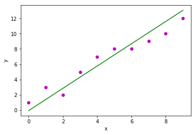

# <center><u>PRACTICAL 5</u></center> #
## Aim ##
To implement Linear Regression

## Description of aim and related theory ##
In statistics, linear regression is a linear approach for modeling the relationship between a scalar dependent variable y and one or more explanatory variables (or independent variables) denoted X. The case of one explanatory variable is called simple linear regression. For more than one explanatory variable, the process is called multiple linear regression.

Least Squared Error is used as the loss function. For learning the weights, Stochastic Gradient Descent is used in this experiment to update the weights in order to lead to minimum loss. 

Linear regression is widely used in biological, behavioral and social sciences to describe possible relationships between variables. It ranks as one of the most important tools used in these disciplines.
​	
## Code ##
```python
import numpy as np
import matplotlib.pyplot as plt

def estimate_coef(x, y):
    # number of observations/points
    n = np.size(x)

    # mean of x and y vector
    m_x, m_y = np.mean(x), np.mean(y)

    # calculating cross-deviation and deviation about x
    SS_xy = np.sum(y*x - n*m_y*m_x)
    SS_xx = np.sum(x*x - n*m_x*m_x)

    # calculating regression coefficients
    b_1 = SS_xy / SS_xx
    b_0 = m_y - b_1*m_x

    return(b_0, b_1)

def plot_regression_line(x, y, b):
    # plotting the actual points as scatter plot
    plt.scatter(x, y, color = "m",
               marker = "o", s = 30)

    # predicted response vector
    y_pred = b[0] + b[1]*x

    # plotting the regression line
    plt.plot(x, y_pred, color = "g")

    # putting labels
    plt.xlabel('x')
    plt.ylabel('y')

    # function to show plot
    plt.show()

def main():
    # observations
    x = np.array([0, 1, 2, 3, 4, 5, 6, 7, 8, 9])
    y = np.array([1, 3, 2, 5, 7, 8, 8, 9, 10, 12])

    # estimating coefficients
    b = estimate_coef(x, y)
    print("Estimated coefficients:\nb_0 = {}  \
          \nb_1 = {}".format(b[0], b[1]))

    # plotting regression line
    plot_regression_line(x, y, b)

if __name__ == "__main__":
    main()
```

## Result and Analysis ##



```python
Estimated coefficients:
b_0 = -0.0586206896552            
b_1 = 1.45747126437
```

We implemented Linear Regression.
## Conclusion ##
Pros and Cons of linear regression.

**Pros:**
1. A linear model is much more simple than a quadratic model, and often works just as well for most purposes.
2. Linear regression implements a statistical model that, when relationships between the independent variables and the dependent variable are almost linear, shows optimal results.

**Cons:**
1. It is sensitive to outliers.
2. Overfitting - It is easy to overfit your model such that your regression begins to model the random error (noise) in the data, rather than just the relationship between the variables. This most commonly arises when you have too many parameters compared to the number of samples
3. Linear regressions are meant to describe linear relationships between variables. So, if there is a nonlinear relationship, then you will have a bad model.


