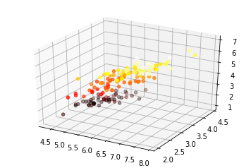
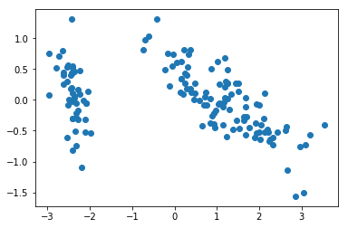

# <center><u>PRACTICAL 9</u></center> #
## Aim ##
To implement principal Component Analysis on a given dataset

## Description of aim and related theory ##
PCA is a linear transformation that finds the "principal components", or directions of greatest variance, in a data set. It can be used for dimension reduction among other applications such as image compression.

In simple words, principal component analysis is a method of extracting important variables (in form of components) from a large set of variables available in a data set. It extracts low dimensional set of features from a high dimensional data set with a motive to capture as much information as possible. With fewer variables, visualization also becomes much more meaningful. PCA is more useful when dealing with 3 or higher dimensional data.

It is always performed on a symmetric correlation or covariance matrix. This means the matrix should be numeric and have standardized data.

In this exercise, we implement PCA and apply it to a simple 2-dimensional data set to understand its working.

## Algorithm ##
``` algorithm
1. Standardize the data.
2. Obtain the Eigenvectors and Eigenvalues from the covariance matrix or correlation matrix, or perform Singular Vector Decomposition.
3. Sort eigenvalues in descending order and choose the k eigenvectors that correspond to the k largest eigenvalues where k is the number of dimensions of the new feature subspace (k≤d).
4. Construct the projection matrix W from the selected k eigenvectors.
5. Transform the original dataset X via W to obtain a k-dimensional feature subspace Y.
```
## Code ##
```python
import pandas as pd
df = pd.read_csv(filepath_or_buffer = 'https://archive.ics.uci.edu/ml/machine-learning-databas
es/iris/iris.data', header = None)
df.columns = ['sepal_len', 'sepal_wid', 'petal_len', 'petal_wid', 'class']
print(df.tail())

# split data table into data X and class labels y
X = df.ix[:,0:4].values
y = df.ix[:,4].values

#heatplot using matplotlib
import matplotlib.pyplot as plt
fig = plt.figure()
ax = fig.add_subplot(111, projection='3d')
ax.scatter(X[:,0],X[:,1],X[:,2],c=X[:,3], cmap = plt.hot())
plt.show()

#scale features if necessary, not necessary here
import numpy as np
#making mean = 0
mean_vec = np.mean(X, axis=0)
X=X-mean_vec
#calculating cov_mat or cor_mat
#cov_mat = (X - mean_vec).T.dot((X - mean_vec)) / (X.shape[0]-1)
#print('Covariance matrix \n%s' %cov_mat)#
# print('NumPy covariance matrix: \n%s' %np.cov(X_std.T))

# can use corelation insead of making standard deviation = 1
cor_mat = np.corrcoef(X.T)#


# eigen decomposition

eig_vals, eig_vecs = np.linalg.eig(cor_mat)
print('Eigenvectors \n%s' %eig_vecs)
print('\nEigenvalues \n%s' %eig_vals)


#eig_vals, eig_vecs = np.linalg.eig(cov_mat)
#print('Eigenvectors \n%s' %eig_vecs)
#print('\nEigenvalues \n%s' %eig_vals)


# Make a list of (eigenvalue, eigenvector) tuples
eig_pairs = [(np.abs(eig_vals[i]), eig_vecs[:,i]) for i in range(len(eig_vals))]

# Sort the (eigenvalue, eigenvector) tuples from high to low
eig_pairs.sort()
eig_pairs.reverse()

#confirm that the list is correctly sorted by decreasing eigenvalues
print('Eigenvalues in descending order:')
for i in eig_pairs:
    print(i[0])

# picking most informative features , EXPLAINED VARIANCE: HOW MUCH INFO COULD BE ATTRIBUTED TO
EACH OF THE PRINCIPAL COMPONENTS
tot = sum(eig_vals)
var_exp = [(i / tot)*100 for i in (eig_vals)]
cum_var_exp = np.cumsum(var_exp)

print(cum_var_exp)

# PROJECTION MATRIX
proj_mat = eig_vecs[ : , 0:2]
print(proj_mat.shape)

#PROJECT ALONG NEW AXES
Y = X.dot(proj_mat)
print(Y.shape)
plt.scatter(Y[:,0],Y[:,1])
plt.show()
```
## Result and Analysis ##
We performed PCA on a 4-dimensional dataset (visualized using a heatmap as shown below)


and reduced it into 2 dimensions (shown in the scatterplot below) 


while retaining approximately 95% of the information.
## Conclusion ##
PCA is a powerful decomposition technique for linear dimensionality reduction to project data into a lower dimensional space.